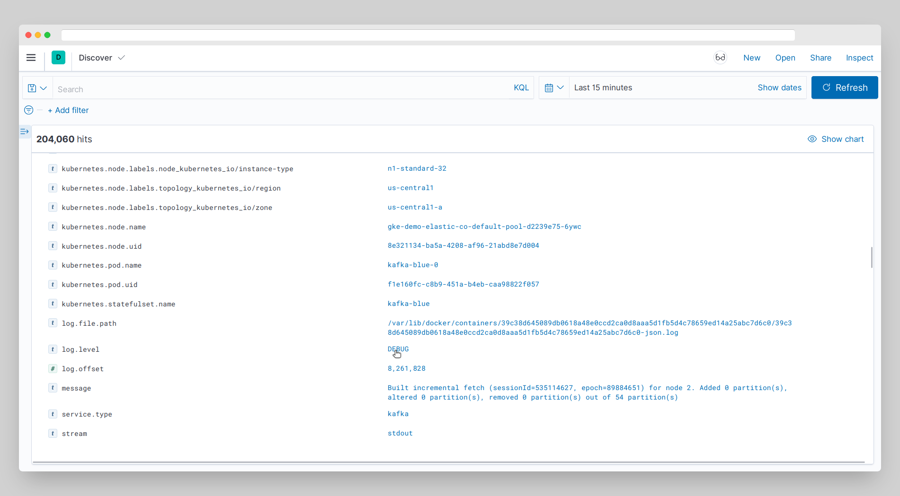

# Kibana Clicker — browser extension for Kibana

The extension creates links for quick filtering logs in Kibana.



[Kibana demo site](https://demo.elastic.co/app/discover#/)

### Run the extension in development mode

```sh
npm run dev
```

Then load the extension in your browser (only once) by following this guide in Plasmo documentation for Chrome [Loading the Extension in Chrome](https://docs.plasmo.com/framework#loading-the-extension-in-chrome).

### Publish new version

1. Make sure all changes are committed and pushed to the main branch.
2. Run `npm version patch` to bump the version number. It will create a new commit and tag.
3. Push the new commit and tag to the main branch `git push --follow-tags origin main`.
4. Open Actions page on GitHub and check status of the [Publish to Chrome Web Store](https://github.com/hyzyla/kibana-clicker/actions/workflows/submit.yml) workflow

### TODO:

- [x] Add support for OpenSearch
- [ ] Add documentation about project structure
- [ ] Inject links on viewer change
- [ ] Add links on single document page
- [ ] Add links on table page
- [x] Add LICENSE
