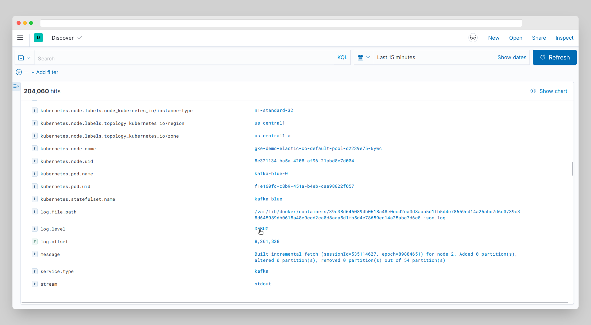

# Kibana Clicker — browser extension for Kibana

The extension creates links for quick filtering logs in Kibana.

[Kibana demo site](https://demo.elastic.co/app/discover#/)
### Build locally

1. run `npm install` to install all required dependencies
2. run `npm run build` to build extension

The build step will create the `distribution` folder, this folder will contain
the generated extension.

### Run the extension

1. run `npm run watch` to watch for file changes and build continuously
2. in another terminal, run `npm run start:firefox` for Firefox
   or `npm run start:chrome` for Chrome.

### Other
Built using
[fregante/browser-extension-template](https://github.com/fregante/browser-extension-template/generate)
template
